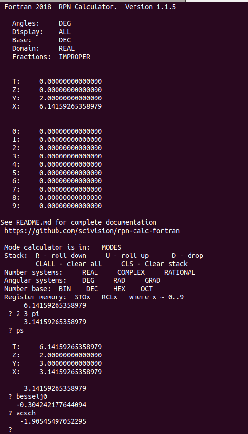

[](https://travis-ci.com/scivision/rpn-calc-fortran)
[](https://ci.appveyor.com/project/scivision/rpn-calc-fortran)

# RPN Reverse Polish Notation Calculator -- in Fortran




The `funcs.90` module provides over 100 elemental functions not found in Fortran instrinsics.
For full functionality, a Fortran 2008/2018 compatible compiler is required such as `gfortran` or `ifort`.

Specifically, RPNcalc is covered by continuous integration and testing on Linux, Mac and Windows, including:
* Gfortran 5, 6, 7, 8 
* ifort 2019
* PGI `pgf95`
* Nvidia `flang`

The stack size is set by the user with command line option. 
Default size is 4.


#### Authors
* Fortran 77 code: David G. Simpson
* Fortran 2018 code: Michael Hirsch

## Build

Use Meson or CMake.
Do NOT use sudo. 
These commands install `rpncalc` to ~/.local/bin.

### Meson

```sh
cd build

meson ../src --prefix=$HOME/.local

meson install


### CMake

```sh
cd build

cmake ../src

cmake --build . --target install
```

## Usage

    rpncalc
    
Enter numbers and operations separated by blanks or carriage returns.
The contents of the X register will be printed after each carriage return.
For example:

              X

    2 3 +     5.0000
    6 *      30.0000
    SIN       0.5000
  
To exit the program, type: 
  
    q
    
To get a brief help:

    help

### set stack size
The default stack size is 4, and may be betweeen 2..99 levels.
Set the stack size at runtime, say 25 by:

    rpncalc 25

    
Show what modes the calculator is in with:

    MODES       Print modes
    
    
### Modes
The Fortran 2018 RPN calculator has 3 operating modes.
The default mode is REAL

    COMPLEX     COMPLEX mode
    REAL        REAL mode
    RATIONAL    Rational (fraction) mode

Additionally, angle modes can be selected like any scientific calculator:

  
    DEFAULT     Restore default modes
    
    GRAD        Grads mode
    RAD         Radians mode
    DEG         Degrees mode
    
### Number base selection

    DEC         Decimal mode   ( default )
    BIN         Binary mode
    HEX         Hexadecimal mode
    OCT         Octal mode
    
### Stack operations
These operations are fundamental to RPN use, and constitute some of RPN's key advantages over other calculating methods.

    R           Roll stack down
    U           Roll stack up
    D           Drop lowest (X) register from stack
    
    CLALL       Clear all
    CLREG       Clear general registers
    CLS         Clear summation registers
    CLSTK       Clear stack
    CLX         Clear X

    RESET       Reset calculator to initial state

    LASTX       Recall last X
    
    PR          Print registers
    PS          Print stack
    PSUMS       Print sums
    
### Registers
There are ten registers (0..9) accessed with:


    STOx       Store, where x ~ 0..9  e.g. STO3   STO6
    RCLx       Recall, where x ~ 0..9 e.g. RCL3   RCL6
    
### Digits of precision display

For each case, x ~ (0..9) digits of DISPLAYED precision.
Iinternal precision remains at 32 or 64 bits, set when compiled.

    ENGx         Engineering notation
    FIXx         Fix notation
    SCIx         Scientific notation

Other display modes:

    IMPROPER    Improper fraction display mode
    MIXED       Mixed fraction display mode

    ALL         ALL digits display mode  
    
    
### Common Functions

    +           Addition
    -           Subtraction
    *           Multiplication
    /           Division
    ^           Exponentiation
    \           Reciprocal
    
    
    2X          2^x
    
    SQR         Square
    SQRT        Square root

    HYPOT       Compute SQRT(X^2+Y^2)
    HYPOT3      Compute SQRT(X^2+Y^2+Z^2)
    
    CUBE        Cube
    CBRT        Cube root
    
    !           Factorial (= GAMMA(n+1))
    
    ROUND       Round to integer
    
    CHS         Change sign
    
    FRAC        Fractional part
    FRACTOL     Set fraction tolerance

    
### Complex functions
These utility functions are for operations with numbers having a real and imaginary component.
Most of the functions overall in the program can handle real and complex numbers, using Fortran 2003+ polymorphism.

    ABS         Absolute value
    CONJ        Complex conjugate
    
    I           i (imaginary unit)
    
    IM          Imaginary component
    RE          Real component
    ARG         Argument of a complex number
    
    RI          Exchange real and imaginary parts


### Conversions

    P>R         Polar to rectangular
    R>D         Radians to degrees
    R>P         Rectangular to polar
    D>F         Decimal to fraction
    D>R         Degrees to radians
    
    C>F         Celsius to Fahrenheit
    CM>IN       Centimeter to inches
    F>C         Fahrenheit to Celsius
    GAL>L       Gallons to liters
    HMS>H       HMS to hours
    KG>LB       Kilograms to pounds
    L>GAL       Liters to gallons
    H>HMS       Hours to HMS
    LB>KG       Pounds to kilograms
    IN>CM       Inches to centimeters


### Trigonometric

    SIN         Sine
    ASIN        Inverse sine
    
    COS         Cosine
    ACOS        Inverse cosine

    COT         Cotangent
    ACOT        Inverse cotangent
    ACOT2       Inverse cotangent (2 args)
    
    CSC         Cosecant
    ACSC        Inverse cosecant

    SEC         Secant
    ASEC        Inverse secant

    TAN         Tangent
    ATAN        Inverse tangent
    ATAN2       Inverse tangent (2 args)
    
    AHAV        Inverse haversine
    HAV         Haversine
    
### Hyperbolic

    ACOSH       Inverse hyperbolic cosine
    ACOTH       Inverse hyperbolic cotangent
    COSH        Hyperbolic cosine
    COTH        Hyperbolic cotangent
    
    ASECH       Inverse hyperbolic secant
    ACSCH       Inverse hyperbolic cosecant
    ASINH       Inverse hyperbolic sine
    ATANH       Inverse hyperbolic tangent
    
    SINH        Hyperbolic sine
    TANH        Hyperbolic tangent
    SECH        Hyperbolic secant
    CSCH        Hyperbolic cosecant
    
### Logarithms

    XRT         X root of Y
    
    EXP         exp(x)
    10X         10^x
    
    LN          Natural logarithm
    LOG         Common logarithm
    LOG2        Logarithm base 2
    
### Rational numbers

    GCD         Greatest common divisor
    LCM         Least common multiple
    
    INT         Integer part
    INT/        Integer division
    
### Statistics


    CNR         Combinations
    PNR         Permutations

    LR          Linear regression (leaves b in X, m in Y)
    
    X^          Linear estimate X
    XMEAN       Mean of X
    
    XS          Sample standard deviation of X
    XSIG        Population standard deviation of X
    XY          X-Y exchange
    Y^          Linear estimate Y
    YMEAN       Mean of Y
    YS          Sample standard deviation of Y
    YSIG        Population standard deviation of Y
    
### Constants

    AMU         Atomic mass unit (kg)
    AU          Astronomical unit (m)
    C           Speed of light in vacuum (m/s)
    ECHG        Elementary charge e (C)
    EPS0        Permittivity of free space (F/m)
    EULER       Euler-Mascheroni constant
    G           Standard acceleration due to gravity (m/s^2)
    GOLDEN      Golden ratio
    GRAV        Gravitational constant G (m^3/kg s^2)
    H           Planck constant (J s)
    HBAR        Planck constant (J s)
    KB          Boltzmann constant (J/K)
    ME          Electron mass (kg)
    MN          Neutron mass (kg)
    MP          Proton mass (kg)
    MU0         Permeability of free space (N/A^2)
    MUB         Bohr magneton (A m^2)
    MUN         Nuclear magneton (A m^2)
    NA          Avogadro's number (mol^-1)

        
    PI          Pi   ( ~ 22/7)
    2PI         2 * pi
    2PII        2 * pi * i

    RGAS        Gas constant (J/mol K)
    REARTH      Earth radius (m)
    
    STEFAN      Stefan-Boltzmann constant (W/m^2 K^4)
    
### logical

    AND         Logical AND
    NOT         Logical NOT
    OR          Logical OR
    XOR         Logical XOR
    
### Other Functions

Many functions not commonly found in RPN calculators are included:

    %           Percent
    %CHG        Percent change
    !!          Double factorial

    A0          Bohr radius (m)

    ACOVERS     Inverse coversine
    ACRD        Inverse chord (of Ptolemy)

    AEXSEC      Inverse exsecant

    AVERS       Inverse versine
    BESSELJ0    Bessel function of the first kind, order 0
    BESSELJ1    Bessel function of the first kind, order 1
    BESSELJ1P   first derivative J'1(x)
    BESSELJ     Bessel function of the first kind, real order
    
    BESSELY0    Bessel function of the second kind, order 0
    BESSELY1    Bessel function of the second kind, order 1
    BESSELY     Bessel function of the second kind, real order
    
    BESSELI0    Modified Bessel function of the first kind, order 0
    BESSELI1    Modified Bessel function of the first kind, order 1
    BESSELI     Modified Bessel function of the first kind, real order
    
    BESSELK0    Modified Bessel function of the second kind, order 0
    BESSELK1    Modified Bessel function of the second kind, order 1
    BESSELK     Modified Bessel function of the second kind, real order
    
    JINC        [JINC sombrero function](https://en.wikipedia.org/wiki/Sombrero_function)  J1(x)/x 
    
    BETA        Beta function

    COVERS      Coversine
    CRD         Chord (of Ptolemy)

    DIGAMMA     Digamma function
    DUP         Duplicate X

    ERF         Error function
    ERFC        Complementary error function

    EXSEC       Exsecant

    GAMMA       Gamma function

    HMS+        HMS add
    HMS-        HMS subtract


    KEPLER      Solves elliptical Kepler's equation (e,M -> E)

    MOD         Modulo

    N           Number of points in summation

    RAND        Random number

    RCORR       Linear regression correlation coefficient

    REDUCE      Reduce an angle

    REV         Revs mode

    RZETA       Riemann zeta function
    S           Summation
    S-          Delete summation

    SGN         Signum

    SINC        [cardinal sine (sinc) function  sin(x) / x](https://en.wikipedia.org/wiki/Sinc_function)

    SINHC       Sinhc function

    SUMX        Summation of X
    SUMX2       Summation of X^2
    SUMXY       Summation of XY
    SUMY        Summation of Y
    SUMY2       Summation of Y^2

    TANC        Tanc function

    TANHC       Tanhc function
    TIME        Current date and time
    VER         Print software version
    VERS        Versine

    
### Possible future operations:
    
    ?           Incomplete gamma functions (upper and lower)
    ?           Incomplete beta function
    ?           Spherical Bessel functions j, n
    ?           Legendre functions Pnm, Qnm (various normalizations)
    ?           Legendre polynomials
    ?           Elliptic integrals
    ?           Jacobi elliptic functions sn, cn, dn
    ?           Jacobi amplitude function am
    ?           Exponential integrals
    ?           Hypergeometric functions
    ?           Hermite polynomials

